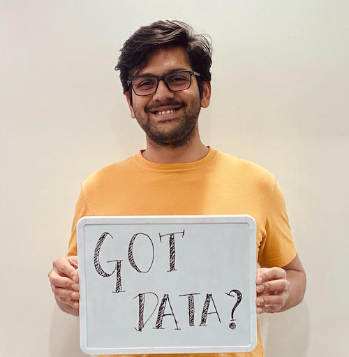

<a class=sehero name=top> 
<p></p>
<h1> SE for super heroes: an AI approach </h1> <p> <a
href="https://github.com/sehero/lua/blob/master/README.md#top">home</a> :: <a
href="https://github.com/sehero/lua">code</a> :: <a
href="https://github.com/sehero/lua/blob/master/LICENSE">license</a> :: <a
href="https://github.com/sehero/lua/blob/master/INSTALL.md#top">install</a> :: <a
href="https://github.com/sehero/lua/blob/master/CODE_OF_CONDUCT.md#top">contribute</a> :: <a
href="https://github.com/sehero/lua/issues">issues</a> :: <a
href="https://github.com/sehero/lua/blob/master/CITATION.md#top">cite</a> :: <a
href="https://github.com/sehero/lua/blob/master/CONTACT.md#top">contact</a> </p><p> 
   
    
  
<br>
<a href="https://zenodo.org/badge/latestdoi/263210595"></a><br>
<br>  
</p>


## Cite as ...

T. Menzies. 
_Sehero/lua: lua code, AI for SE_    
May, 2020, 
https://doi.org/10.5281/zenodo.3825872

```bitex
@software{sehero_lua,
  author       = {Tim Menzies},
  title        = {Sehero/lua: lua code, AI for SE},
  month        = May,
  year         = 2020,
  publisher    = {Zenodo},
  version      = {three},
  doi          = {10.5281/zenodo.3825872},
  url          = {https://doi.org/10.5281/zenodo.3825872}
}
```

### Co-authors

We may not be  SE super heroes-- but we are  their biggest fans.

<table>
<tr>
<td align=center  valign=bottom>

<td align=center  valign=bottom>

<td align=center  valign=bottom>

</tr>
<tr>
<td align=center >
<a href="https://www.amritanshu.us">Dr. Amritanshu Agrawal</a>
 <br> data scientist, Wayfair, Boston, USA
<td align=center >
<a href="">Dr. Wei Fu<br> Landing AI,  USA
<td align=middle >
<a href="https://greg4cr.github.io">Dr. Greg Gay</a><br> Chalmers and the University of Gothenburg, Sweden
</tr>
<tr>
<td align=center  valign=bottom>

<td align=center  valign=bottom>

<td align=center  valign=bottom>

</tr>
<tr>
<td align=center >
<a href="http://menzies.us">Prof. Tim Menzies</a><br> North Carolina State University, USA 
<td align=center >
<a href="http://vivekaxl.github.io">Dr. Vivek Nair</a><br>  Facebook,  USA
<td align=center >
<a href="http://azhe825.github.io">Dr. Zhe Yu</a><br> Rochester Instituate of Technology, USA
</tr>
<tr>
<td align=center  valign=bottom>

</tr>
<tr>
<td align=center >
Dr. Rahul Krihsna,<br>Columbia University, USA
</tr>
</table>
