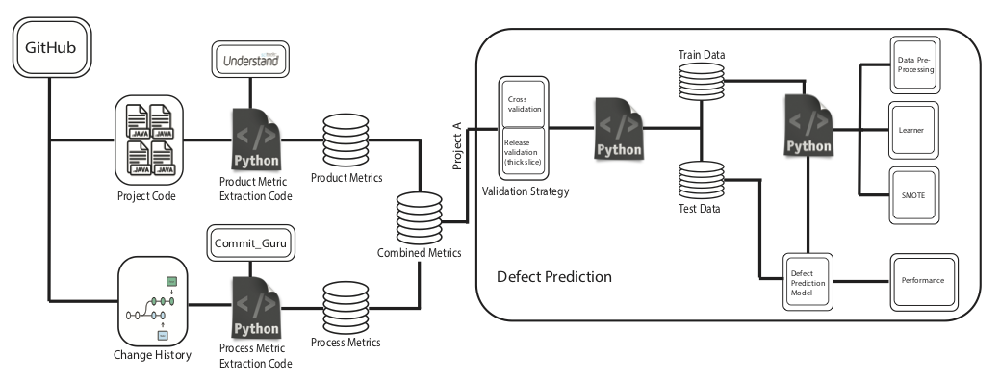

<b>SE for super heroes: an AI approach
</b> <a 
href="https://github.com/sehero/src/blob/master/README.md">about</a>  :: <a 
href="https://github.com/ai-se/perfect-repo">code</a>  :: <a 
href="https://github.com/ai-se/perfect-repo/blob/master/LICENSE">license</a>  :: <a 
href="https://github.com/ai-se/perfect-repo/blob/master/INSTALL.md">install</a> :: <a
href="https://github.com/ai-se/perfect-repo/blob/master/CODE_OF_CONDUCT.md">contribute</a> :: <a 
href="https://github.com/ai-se/perfect-repo/issues">issues</a> ::  <a 
href="https://github.com/ai-se/perfect-repo/blob/master/CONTACT.md">contact</a> 
 &nbsp;&nbsp;&nbsp;&nbsp; 

# [Predicting Project Health for Open Source Project](doc/paper.pdf)

Software developed on  public platforms are a source of data that
can be used to make predictions about those projects. While the
activity of a single developer may be random and hard to predict,
when large groups of developers work together on software projects,
the resulting behavior can be predicted with good accuracy.

To demonstrate this, we use 78,455 months of data from 1,628 GitHub
projects to make various predictions about the current status of
those projects (as of April 2020). We find that traditional estimation
algorithms make many mistakes. Algorithms like $k$-nearest neighbors
(KNN), support vector regression (SVR), random forest (RFT), linear
regression (LNR), and regression trees (CART) have high error rates
(usually more than 50% wrong, sometimes over 130% wrong, median
values). But that error rate can be  greatly reduced using the
DECART hyperparameter optimization. DECART is a differential evolution
(DE) algorithm that tunes the CART data mining system to the
particular details of a specific project.

To the best of our knowledge, this is the largest study yet conducted,
using the most recent data, for predicting multiple health indicators
of open-source projects. Further, due to our use of hyperparameter
optimization, it may be the most successful. Our predictions have
less than 10% error (median value) which is much smaller than the
errors seen in related work.

Our results are a compelling argument for  open-sourced development.
Companies that only build in-house proprietary products may be
cutting themselves off from the information needed to reason about
those projects.

## Links 
  - [Paper](etc/pdf/paper.pdf)
  - [Data](data/README.md)
  - RQ1: [doc](doc/RQ1.md); [src](src/RQ1.sh)
  - RQ2: [doc](doc/RQ2.md);  [src](src/RQ2.sh) 
  -  ...
  
## Configuration <== optional
